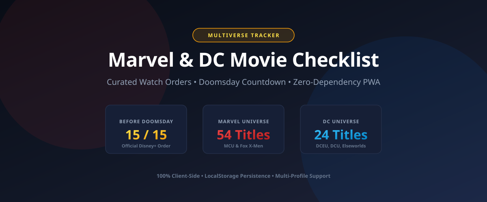

# Multiverse Tracker: Marvel & DC Movie & Series Checklist

[](https://github.com/<owner>/<repo>/actions/workflows/deploy.yml) [](https://opensource.org/licenses/MIT)

**Live Site:** [https://<owner>.github.io/<repo>/](https://<owner>.github.io/<repo>/)

A fast, production-ready, zero-dependency Marvel and DC movie & series tracker website built for static hosting on GitHub Pages. Features 199 comprehensively curated titles, chronological in-universe roadmaps, multi-season TV tracking, a live countdown to *Avengers: Doomsday* (December 18, 2026), multi-profile offline browser storage, and procedural SVG artwork.



---

## 🌟 Key Features

### 1. Zero External Dependencies & GitHub Pages Optimized
- **Pure Web Standards**: Plain HTML5, Vanilla CSS, and modern JavaScript (ES Modules). No build step, no npm packages, no bundlers, and no backend server required.
- **100% Offline Capable**: Zero CDN calls, zero external web fonts (uses native system font stack), zero remote image dependencies.
- **Procedural Cinema Posters**: High-contrast, mathematically drawn vector SVG poster graphics customized by franchise, canon, and emblem (MCU, X-Men, Spider-Man, Defenders, Batman, Superman, Arrowverse, Fantastic Four).
- **Sub-Path Resilience**: Works seamlessly from any repository sub-directory (`https://<username>.github.io/<repo>/`) using relative paths throughout.
- **Hash-Based Router**: Client router (`#/home`, `#/progress`, `#/plan`, `#/profiles`) ensures page refreshes never 404 on static hosts. Includes an empty `.nojekyll` file at the root.

### 2. Comprehensive 199-Title Catalog & Scope Tiers
- **Expanded Multiverse Scope**:
  - **MCU Canon**: All theatrical films, Disney+ series, specials (*Werewolf by Night*, *GotG Holiday Special*), shorts (*I Am Groot*, Marvel One-Shots), and Marvel Animation (*What If...?*, *X-Men '97*).
  - **Non-MCU Marvel**: Complete Fox X-Men saga, Netflix Defenders saga (*Daredevil*, *Jessica Jones*, *Luke Cage*, *Iron Fist*, *The Defenders*, *The Punisher*), Sony Spider-Man films (Raimi, Webb, *Spider-Verse*, SSU), Fox Fantastic Four, and classics (*Blade*, *Hulk 2003*, *Daredevil 2003*, *Ghost Rider*).
  - **DC Multiverse**: DCEU (Snyderverse), DCU (Chapter One: *Creature Commandos*, *Superman 2025*, *Peacemaker*), Elseworlds (*The Batman*, *The Penguin*, *Joker*), Legacy DC (Reeve *Superman*, Burton/Schumacher *Batman*, Nolan's *Dark Knight* trilogy, *Watchmen*, *Constantine*, *V for Vendetta*), and Arrowverse core series.
- **Catalog Breadth Tiers**:
  - **Core (104 titles)**: Essential universe tentpoles (MCU core films & live-action series, Fox X-Men films, DCEU films, DCU Chapter One, Elseworlds).
  - **+ Extended (172 titles)**: Core plus Defenders saga, Sony Spider-Man, Fox Fantastic Four, Burton/Nolan Batman, Reeve Superman, and television spin-offs.
  - **Everything (199 titles)**: Complete collection including animated series, specials, shorts, Marvel One-Shots, and Arrowverse.
  - Breadth preference is persisted per profile and filters the view, backlog, and plan generator.

### 3. Multi-Season TV Series Tracking
- **Granular Season Checkboxes**: TV series display individual season checkboxes (`[S1]`, `[S2]`, ..., `[SN]`) alongside total season counts and platform badges.
- **Per-Season Storage**: Saved under `watched[id].seasons = [1, 2, ...]`.
- **Partial Watched Badges**: Displays progress such as `1/3 S` when a series is partially completed, and automatically advances to full "Watched" status when all seasons are finished.

### 4. Live Countdown & Progress Rings
- **Avengers: Doomsday Countdown**: Real-time ticker counting down to December 18, 2026 (Days, Hours, Minutes, Seconds).
- **Animated SVG Progress Rings**: Live indicators showing progress for:
  - *Before Doomsday*: Essential Disney+ priority watchlist (15 official titles).
  - *Marvel*: Progress scaled to your active catalog tier (Core, Extended, or Everything).
  - *DC*: Progress scaled to your active catalog tier.

### 5. Dual Carousels & Multi-Criteria Filtering
- **Slider A (Before Doomsday)**:
  - Displays the 15 official titles (14 films + *Loki* S1-2) sorted strictly by official Disney+ `doomsdayOrder`.
  - Toggle **"Include optional picks (+14)"** to view curated backstory titles with curator rationale.
  - Shows clear **Doomsday Preparation** rationale badges on optional picks explaining why each title connects to Doomsday.
- **Slider B (Complete Catalog)**:
  - Full catalog filtering with simultaneous AND logic:
    - **Breadth Tier**: Core / + Extended / Everything
    - **Universe**: All / Marvel / DC
    - **Type**: All / Movies / Series / Specials / Shorts
    - **Canon**: All / MCU canon / Non-MCU Marvel / DCU / DCEU / Elseworlds / Legacy DC / Arrowverse
    - **Platform**: All / Theaters / Disney+ / Netflix / Max / Prime Video / Fox / CW / Other
    - **Collection**: All / Spider-Man / Batman / Superman / X-Men / Avengers / Defenders / etc.
    - **Status**: All / Watched / Unwatched
    - **Title Search**: Live debounced search across titles, characters, eras, collections, and notes.
    - **Sort**: Release Order vs. Chronological Order.
  - **Grid / Carousel View Toggle**: Switch between touch/drag scroll-snap carousel and responsive multi-column grid.

### 6. Watch Plan Generator & Up Next Engine (`#/plan`)
- **Ordering Modes**:
  - **Release Order**: Global theatrical/streaming release sequence (1..199).
  - **Chronological Canon Blocks**:
    1. Fox X-Men in-universe timeline (*First Class* → *Origins* → *Days of Future Past* → ... → *Logan*).
    2. Marvel Cinematic Universe story sequence (official Disney+ timeline interleaving films, series, and specials).
    3. Other Marvel (Sony, legacy Marvel).
    4. DCEU (Snyderverse).
    5. DCU (Chapter One).
    6. Elseworlds.
    7. Legacy DC.
    8. Arrowverse.
    *(Includes friendly DC chronology disclaimer note).*
- **Scopes**: Before Doomsday (Official), Before Doomsday + Optional, All Marvel, All DC, Everything.
- **Up Next Target (`#/progress`)**: Drives your next watch automatically from your saved plan.

### 7. Multi-Profile Storage & Recovery (`#/profiles`)
- **Independent Profiles**: Create, rename, delete, and switch profiles. Each profile maintains its own checklist, season history, active watch plan, and filter preferences.
- **Schema Versioning**: `DATA_VERSION = 2`. Upgrades seamlessly and handles missing or orphaned fields gracefully.
- **Corruption Recovery**: If stored JSON is ever corrupted, raw data is backed up under `mcu-tracker:v1:backup` and a fresh state is initialized without crashing.
- **Export & Import**: Full backup or single profile JSON export/import.

---

## 🚀 Running Locally

No npm or build tools are required. Any local static HTTP server can run the site:

### Option 1: Python 3
```bash
python3 -m http.server 8000
```
Open [http://localhost:8000](http://localhost:8000) in your browser.

### Option 2: Node.js (npx serve or http-server)
```bash
npx serve .
```

### Option 3: VS Code Live Server
Right-click `index.html` and click **"Open with Live Server"**.

---

## 🛠️ Data Pipeline & Validation (Node.js 18+, Zero npm deps)

The single source of truth is `/data/catalog.csv`. To rebuild and validate the catalog without npm packages:

```bash
# 1. Regenerate js/data.js from data/catalog.csv
node scripts/csv-to-data.mjs

# 2. Run data integrity & schema validation
node scripts/validate-data.mjs

# 3. Run the comprehensive automated acceptance test suite
node scripts/test-acceptance.mjs
```

### Fetching TMDB Posters
To enable high-resolution movie and series posters, you can run the offline poster fetcher script. It matches titles against the TMDB API and writes the metadata directly into the codebase.

1. Create a free account at [The Movie Database (TMDB)](https://www.themoviedb.org)
2. Go to **Account Settings > API** and create a key for Personal/Non-commercial use.
3. Copy your "API Read Access Token" (the v4 Bearer auth token).
4. Run the script with your token:
```bash
export TMDB_TOKEN="your_token_here"
node scripts/fetch-posters.mjs
```
The script will output `js/posters.js` and a detailed `data/poster-report.md`. To refresh all cached posters (required every 6 months per TMDB terms of use), run:
```bash
node scripts/fetch-posters.mjs --refresh
```
You can also fetch only specific IDs: `node scripts/fetch-posters.mjs --only=iron-man-2008`

**Fixing a wrong TMDB match**: If the script mismatched a title, open `data/tmdb-overrides.json` and add an exact override mapping using the correct TMDB ID. Then re-run the script.
```json
{
  "wrong-movie-id": {
    "tmdbId": 12345,
    "type": "movie"
  }
}
```

### Validation Checks Enforced by `validate-data.mjs`:
- Zero duplicate IDs.
- All 78 baseline IDs strictly preserved to guarantee existing user progress never breaks.
- Release orders are continuous integers (1..199).
- Chronological orders are unique continuous integers (1..N) within each canon block.
- Exactly 15 official Doomsday titles (1..15) without gaps or duplicates.
- All optional Doomsday titles have a documented `doomsdayReason`.
- All dates are valid ISO formats (`YYYY`, `YYYY-MM`, or `YYYY-MM-DD`).

---

## 📝 Catalog Schema (`/data/catalog.csv` & `js/data.js`)

Each title entry adheres to the following schema:

| Field | Type | Description |
|---|---|---|
| `id` | `string` | Unique, stable slug (e.g. `iron-man-2008`). Keyed in localStorage. |
| `universe` | `string` | `"Marvel"` or `"DC"`. |
| `franchise` | `string` | Specific franchise (e.g. `"MCU"`, `"Defenders Saga"`, `"Batman (Burton/Schumacher)"`). |
| `collection` | `string` | Film group (e.g. `"Avengers"`, `"Spider-Man"`, `"Batman"`, `"X-Men"`). |
| `canon` | `string` | Canon block (`"MCU canon"`, `"Non-MCU Marvel"`, `"DCU"`, `"DCEU"`, `"Elseworlds"`, `"Legacy DC"`, `"Arrowverse"`). |
| `type` | `string` | `"Movie"`, `"TV Series"`, `"Special"`, or `"Short"`. |
| `title` | `string` | Official release title. |
| `release` | `string` | ISO date string (`YYYY`, `YYYY-MM`, or `YYYY-MM-DD`). |
| `status` | `string` | `"released"`, `"upcoming"`, or `"tbd"`. |
| `releaseOrder` | `integer` | Global sequence (1..199) sorted by release date then title. |
| `chronoOrder` | `integer` | Sequence within its `canon` block. |
| `chronoApprox` | `boolean` | `true` if story placement is approximated by release order. |
| `era` | `string` | Phase or cinematic era (e.g. `"Phase 1"`, `"The Dark Knight Trilogy"`, `"Gods and Monsters"`). |
| `platform` | `string` | Primary release platform (`"Theaters"`, `"Disney+"`, `"Netflix"`, `"Max"`, `"Prime Video"`, `"Fox"`, `"CW"`, `"Other"`). |
| `seasons` | `integer\|null` | Number of broadcast seasons (series only). |
| `runtimeMin` | `integer\|null` | Theatrical runtime in minutes (movies only). |
| `tier` | `string` | Breadth tier: `"core"`, `"extended"`, or `"fringe"`. |
| `doomsday` | `string` | `"official"`, `"optional"`, `"no"`, or `"na"`. |
| `doomsdayOrder` | `integer\|null` | Integer (1..15) for official Disney+ list, else null. |
| `doomsdayReason` | `string\|null` | Explanatory note for optional titles preparing for Doomsday. |
| `notes` | `string\|null` | Curator commentary, key appearances, or historical context. |
| `tmdbId` | `integer\|null` | Future TMDB metadata placeholder. |
| `tmdbType` | `string\|null` | `"movie"` or `"tv"`. |
| `needsReview` | `boolean` | `true` if date, subtitle, or production status is tentative. |

### Tentative Titles Review (`/data/REVIEW.md`)
Titles marked with `needsReview: true` (e.g. unreleased DCU titles, tentative release windows) are documented in `/data/REVIEW.md` with an explanation for each.

---

## 🔍 Assumptions & Design Decisions

1. **Doomsday Target Date**: The official Disney/Marvel scheduled release date for *Avengers: Doomsday* is December 18, 2026 (`2026-12-18T00:00:00Z`).
2. **Official Disney+ Doomsday List (15 items)**: Strictly follows the 1..15 official sequence curated by Disney+ and Marvel Studios (14 films + *Loki* Seasons 1-2).
3. **Optional Doomsday Recommendations (14 items)**: Handpicked titles with direct relevance to Doctor Doom, multiversal incursions, or character returns (e.g. *Deadpool 1-2*, *Logan*, *Spider-Man: No Way Home*, *Multiverse of Madness*, *WandaVision*, *Agatha All Along*, Raimi *Spider-Man 1-2*, Fox *Fantastic Four 2005*, *X-Men: First Class*, *Days of Future Past*, *Daredevil 2003*).
4. **DC Chronological Approximation**: Because DC comprises multiple distinct universes without a shared in-universe timeline, chronological mode orders DC by canon blocks (*DCEU* → *DCU* → *Elseworlds* → *Legacy DC* → *Arrowverse*), and displays an informative UI disclaimer note.
5. **Upcoming Titles Restrictions**: Titles with future release dates or status `upcoming`/`tbd` display `"Coming <date>"` and cannot be prematurely marked as watched.
6. **Multi-Season Tracking**: TV series with multiple seasons provide individual season buttons `[S1]..[SN]`. Marking individual seasons saves `watched[id].seasons = [...]`. Marking all seasons marks the overall series as completed.
7. **Zero Remote Dependencies**: All fonts use native system stacks (`system-ui, -apple-system, sans-serif`); all posters are generated via procedural vector SVGs.
8. **Performance Optimization**: Cards use CSS `content-visibility: auto` to ensure 60fps scrolling across 199+ items on low-powered mobile devices.

---

## dY'd User Data & Privacy
All user data (watched status, watch plans, settings) is stored locally in the browser using \localStorage\. Data is scoped per origin. **Warning**: Renaming the repository or changing the custom domain will change the origin, which will reset users' saved progress! Users can use the in-app Export/Import feature to back up their data.

---

## dYZ> Legal Notice & Disclaimer
Multiverse Tracker is an unofficial, non-commercial fan project.
Marvel, Marvel Cinematic Universe, The Avengers, and related characters are trademarks and copyrights of Marvel Studios / The Walt Disney Company. DC, Batman, Superman, Justice League, and related characters are trademarks and copyrights of DC Comics / Warner Bros. Discovery. All rights belong to their respective owners.

This product uses the TMDB API but is not endorsed or certified by TMDB. Movie and television series artwork, high-resolution posters, and initial air dates are retrieved via the TMDB API.
